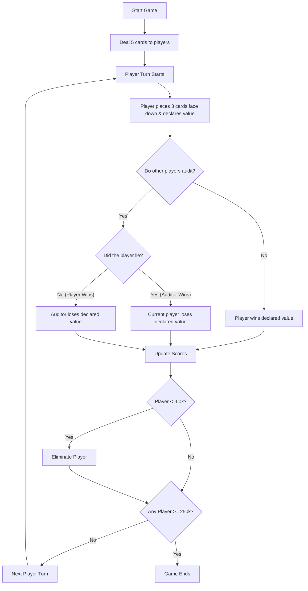

# Development Commentary Questions: Greedy Piggies

Here is a comprehensive list of questions tailored to your role as lead gameplay programmer on **Greedy Piggies**, structured around your `development-commentary-template.md`. Answering these questions will provide all the text and evidence needed to populate your commentary.

### 0. Front Matter & Links

- What is the final URL for your API Reference Link?
- What is the final URL for your User Guide Link?
- What is the final URL for your Build Link?
- What is the final URL or embed code for your Video Demonstration Link?
- Have you recorded a video demonstration covering your tool and the core loop in action?

### 1. Abstract

- What was the main intent of your work on Greedy Piggies for this submission?

To create the core systems and gameplay loop for a multiplayer card game called Greedy Piggies. As well as supporting the work through tools and documentation for the rest of the team.

I was also responsible for helping to manage the git repository for the project, and handle merge conflicts and assist other team members with git issues.

- What were your overall goals?

To create a fun and engaging game that would have a public release on steam.

- How did you approach solving those goals?

I worked as one of the main gameplay programmers on the project, and created the initial gameplay prototype and then developed the core gameplay loop from this.

- What was the final outcome of the core loop development?

I was able to create a fully functional prototype which worked offline with AI opponents, which displayed the core card system.

- What was the final outcome of the tool development?

The main tool I created was the Card Creator tool, which was used to create all of the shop cards in the game.

- If the marker should know one crucial thing about your contribution before reading the rest, what is it?

I was responsible for creation of the core gameplay loop and the git repository management for the project.

### 2. Research

- Which specific games (such as _Liar's Bar_) did you play or research to guide your work?

I researched the game Liar's bar to understand a similar, successful game.

- Which Unreal Engine documentation or tutorials did you use?

I used the unreal engine documentation on data assets and data tables as this is a very data driven game, so organising this data in appropriate formats is key to the game functioning as intended.

- Which academic sources did you use?

**Come back to this**

- How does your research relate to the intended user experience of the game?

- How did these sources influence your technical approach and technical decisions?
- How did these sources influence the creative aim and UI design?
- Were there any source types or specific resources you intentionally avoided?
- Why did you avoid those sources?
- **Evidence Required (For at least 1 game, 1 documentation, 1 academic source):**
  - Who is the creator or publisher of the source?
  - Why is this source relevant to Greedy Piggies?
  - What exactly did you learn or pull from this source?
  - How useful was the source overall?
  - Did the source have any limitations?

### 3. Implementation (Process & Methods)

- How did you initially plan out the core loop (dealing, declaring, auditing)?

I created a flow chart of the core loop to understand the requirements of the game.

- How did your development process evolve from that initial plan to the final implementation?

The initial plan was that the design team would begin the development of the game and would ask for assistance when needed. However, because of the large team size, no one was directly responsible for getting the game loop working, and so I took on this responsibiliy. This meant that I had a much heavier workload than initially expected, and I had to put in a lot of extra hours, particularly in the first few weeks of the project.

- How did the large team of designers interact with your Card Creator tool?

I created the tool and onboarded a few designers to use it, mainly by talking them through the system in person. After the initial onboarding, they were able to go ahead and create all of the files for all of the shop cards, ready for others to add logic to.

- What specific feedback did you receive from the designers about the tool?

I received feedback on what data would be needed for the cards, such as a boolean to determine if the card is passive or not.

- How did you integrate that feedback into the tool's iterations?

Because each data asset uses a struct to define the data, I was able to add new variables to the struct and then go through the existing cards and add the new data to them.

- How exactly did you structure the data handling (e.g., Data Assets, JSON) to mitigate Git conflicts?

- How did this structure allow multiple people to work on separate cards simultaneously and safely?
- Did you explore any completely new tools, workflows, or systems during this process?
- Did you try any new or experimental creative methods when building the shop phase or ability systems?
- Did you try any new or experimental technical methods for these systems?
- Did these experimental methods succeed or force you to change your approach?
- **Evidence Required:**
  - Provide screenshots of the **Unreal Blueprints** or C++ code for calculating pairs/triples multipliers.
  - Provide screenshots of the blueprints/code for the auditing logic.
  - Provide screenshots or a short GIF/video demonstrating the **Card Creator** interface working inside the Unreal Editor.
  - Include a diagram or screenshot showing the final file/folder structure you created for the unified card system.

### 4. Implementation (Technical Challenges)

- What roadblocks did you encounter when implementing the multiplayer networking?
- What roadblocks did you run into regarding state management for the "audit" mechanic?
- How did you resolve these core loop multiplayer roadblocks?
- Did you still face any major Git repository challenges or merge conflicts despite your new tool?
- How did you resolve those specific Git conflicts?
- Did you adjust your team's workflow to prevent them from happening again?
- **Evidence Required:**
  - Provide a screenshot of a complex Blueprint or code snippet that wasn't working initially.
  - Provide a screenshot of the fixed version of that same Blueprint or code snippet to demonstrate your problem-solving process.

### 5. Testing

- What kinds of testing did you conduct for the internal tools (e.g., having designers test the Card Creator)?
- What kinds of testing did you conduct for the game itself (e.g., multiplayer peer testing, user testing)?
- What exactly were you trying to prove or break during the tool tests?
- What exactly were you trying to prove or break during the core loop playtests?
- What did you observe or learn from watching others test your work?
- What were the most significant bugs discovered during testing?
- What were the most significant design flaws discovered during testing?
- How did the discovery of these bugs/flaws directly influence the final build result?
- **Evidence Required:**
  - Prepare a testing table logging tester platforms, device specs, test types, bugs found, FPS, severity, repro steps, and feedback summaries.
  - Provide screenshots or embedded videos of a playtest in progress.
  - Specifically ensure the visual evidence highlights UI functionality, auditing, and shop interactions.

### 6. Critical Reflection

- Reflecting on your role as lead developer, what aspects of the game are you most proud of?
- What aspects of the Card Creator tool are you most proud of?
- Did your tool successfully alleviate the pipeline bottlenecks for your designers? How do you know?
- Did anything in your final piece exceed your original expectations? What and why?
- Were there things that simply didn't work out as expected? Why didn't they work?
- Which systems (like the shop, Git workflow, or state machine) felt clunky or problematic by the end?
- If you had another month and more resources to work on Greedy Piggies, what would you try differently?
- What would you rewrite or completely change if you had more time?

### 7. Formatting & Final Checks (The Marking Criteria)

- Have you used UCA's Harvard Referencing Format for all citations?
- Have you included inline citations for everything that influenced your work (including software and games)?
- Have you included as many hyperlinks as possible for easier navigation?
- Have you used plenty of images, code snippets, drawn diagrams, and tables to support your writing?
- Is your final word count within ±10% of the guideline?

### 8. Declared Assets & Bibliography

- Did you use any external UI packs to build the tool or the game?
- Did you use any third-party card art or 3D models?
- Did you use any third-party audio assets?
- Did you use any tutorial code snippets?
- Did you use GitHub Copilot, ChatGPT, or other AI tools to write scripts?
- Did you use AI tools to troubleshoot Unreal Blueprints?
- Did you use AI tools to format data files or write comments?
- **Action Item:** Keep a specific, itemised list of which scripts/files were generated or modified by AI so you can declare them clearly in your template.
