# **Greedy Piggies: Project Contributions**

**By Harry Dillamore**
Gameplay Programmer & Technical Architect

---

# **Overview of Contributions**

- **Role**: Gameplay Programmer
- **Core Focus**: Translating paper design into a structurally sound digital architecture.
- **Key Deliverables**:
  - Complete authoritative Game Loop (Dealer Actor)
  - Networked Multiplayer Foundation
  - Data-driven Systems (Card Lookup, Scoring)
  - Tooling (Card Creator Editor Utility Widget)

---

# **Rapid Prototyping & AI**

- I created the initial prototype for the game, which included the core gameplay loop and AI opponents.
- This meant that we could test the game loop and find any issues with it early on.

---

# **The Dealer Architecture**

- Transitioned from a component-based attempt to a central, **authoritative Dealer Actor**.
- Manages the absolute flow of the game, including safely transitioning between Regular turns and Shop phases over the network.
- Handled via `Event BeginPlay`, `For Loop` macros, and strict flow control.

 

  

---

# **Multiplayer Integration**

- A completely new discipline: adopted **pair programming** to navigate Unreal's replication paradigms.
- **Server Authority:** State execution ring-fenced via `Switch Has Authority` macros.
- **Remote Procedure Calls (RPCs):** Built targeted communication boundaries.

 

  

---

# **Data-Driven Architecture**

- Segregated hard data from logic frameworks to ensure stability and **stop Git-merge conflicts**.
- Utilized static **Unreal Data Tables** to store card indexes, values, and image paths.
- Logic retrieves structured data cleanly using `Get Data Table Row` and `Break Struct` nodes rather than relying on messy variable clusters.

 

  

---

# **Auditing Mechanics**

- Executed the game's core "bluffing" conflict using conditional `Branch` and `Sequence` nodes.
- Evaluates truth tables (Did they lie? Were they audited?) to apply scoring penalties safely on the server.
- _Next Steps:_ Refactoring recursive polling into an asynchronous State Machine.

 

  

---

# **Card Creator Tool**

- Created an **Editor Utility Widget** to provide designers with a simple, automated asset production pipeline.
- Input fields programmatically trigger `Construct Object from Class` nodes to generate matching **Data Assets** automatically.
- Standardized action events inherently via **Blueprint Interfaces**.

 

  

---

# **Impact & Reflection**

### **Successes**

- The Card Creator pipeline completely prevented Git friction.
- Overcame steep learning curves to validate complex networked RPCs and Server-Authority workflows.

### **Areas for Improvement**

- Transition away from prototyping UI (`Print String`) into dedicated UMG Widgets.
- Decentralize logic out of the monolithic Dealer Actor.
