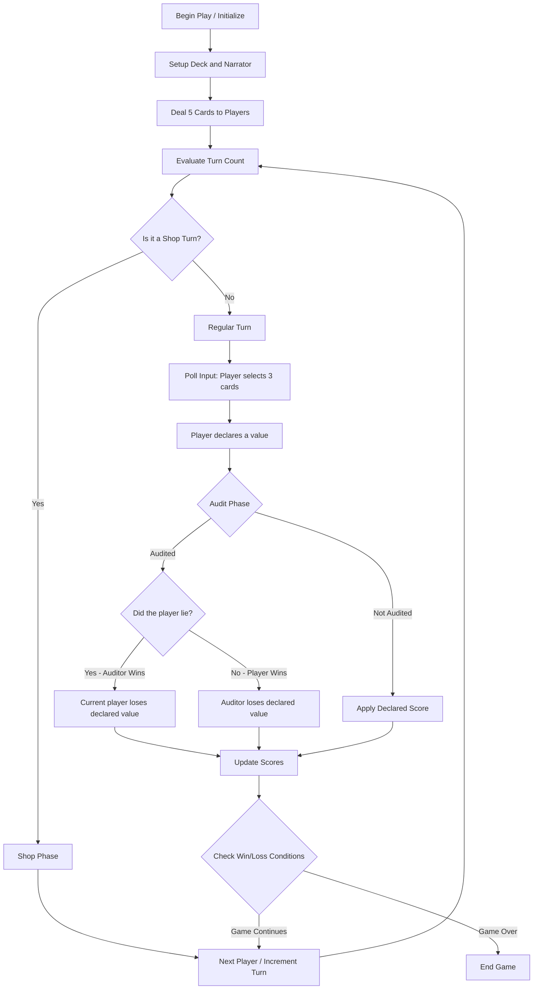
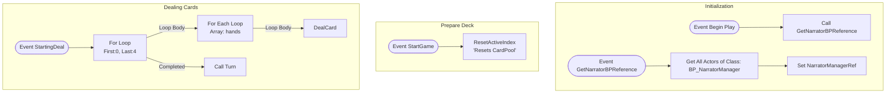
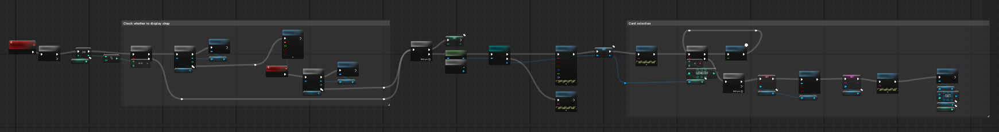
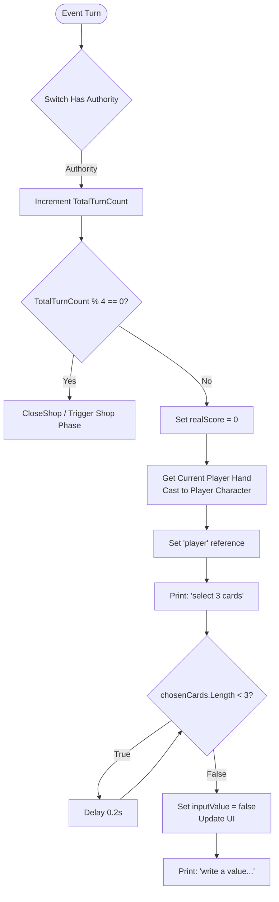

# dealer

this is the actor which is responsible for dealing cards to the players and handling the majority of the game logic, I chose to put the logic in a single authoritative actor to make it easier to manage and debug the game logic.

- the logic is spit up into many custom events to make it easy trigger different parts of the game loop.
- I attempted to migrate the logic to components to make it easier to involve more people working simultainiously, however, this was not so successful because I could not get people to consistantly work like this and since not enough people were activley working on the logic of the game, it was not worth the time investement.

## start game

This section manages the setup of the game, taking place across three main execution paths:

**1. Initialization (BeginPlay)**
On `BeginPlay`, the Dealer triggers `GetNarratorBPReference`. This searches the level using `GetAllActorsOfClass` to find the `BP_NarratorManager` and caches a reference to it in `NarratorManagerRef` so it can be easily accessed throughout the game without performance overhead.

**2. Game Reset (StartGame)**
The `StartGame` custom event is executed to initialize a session. It strictly calls `ResetActiveIndex`, which readies a fresh Card Pool for the game.

**3. Dealing Phase (StartingDeal)**
The `StartingDeal` event handles dispensing the initial hands to all players. It runs a `For Loop` five times (indices 0 to 4). During each of the 5 iterations, a nested `For Each Loop` iterates through the `hands` array (containing all active player hands) and executes `DealCard` to give every player one card at a time. Once the outer loop finishes dealing 5 cards to everyone, it fires the `Turn` function to officially begin gameplay.

## turn

This section manages the individual player progression and handles the input polling at the start of a turn:

**1. Turn & Shop Tracking**
When the `Turn` event fires, the server (via a `Switch Has Authority` check) increments the `TotalTurnCount`. It uses a modulo operation (`TotalTurnCount % 4 == 0`) to determine if it is time for a Shop Phase or a Regular Turn. (As per the design, a shop phase occurs periodically).

**2. Turn Initialization**
If it is a Regular Turn, the system sets up the state by resetting the `realScore` to 0. It determines the active player by grabbing the current hand, casting it to the character (`BP_FirstPersonCharacter_HarryTesting`), and caching this as the `player` variable.

**3. Input Polling**
With the player referenced, it prints "select 3 cards" to the screen. It then enters an input polling loop using a 0.2-second `Delay` to repeatedly check if the length of the `player.chosenCards` array is less than 3.

**4. Value Declaration Prep**
Once the player has selected 3 cards, the loop breaks. The sequence moves to prepare for the value declaration: it resets the player's input state (`inputValue = false`), toggles some UI element visibility (`SetVisibility`), and prompts the player to "write a value or type 0 to tell the truth" on the screen.

