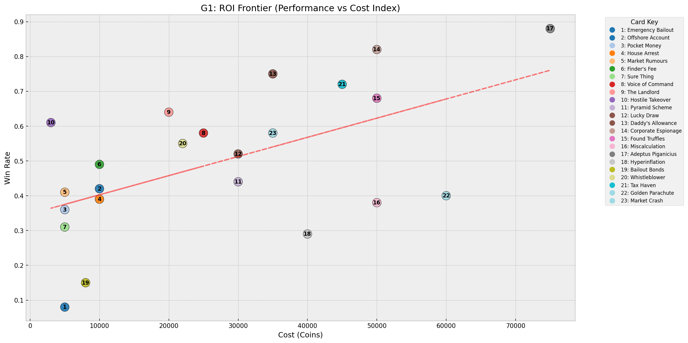
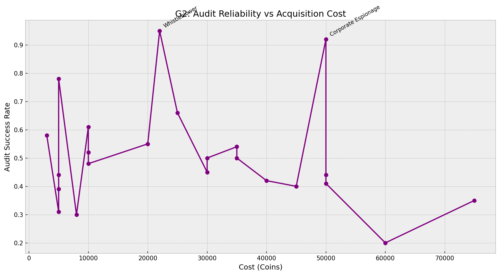
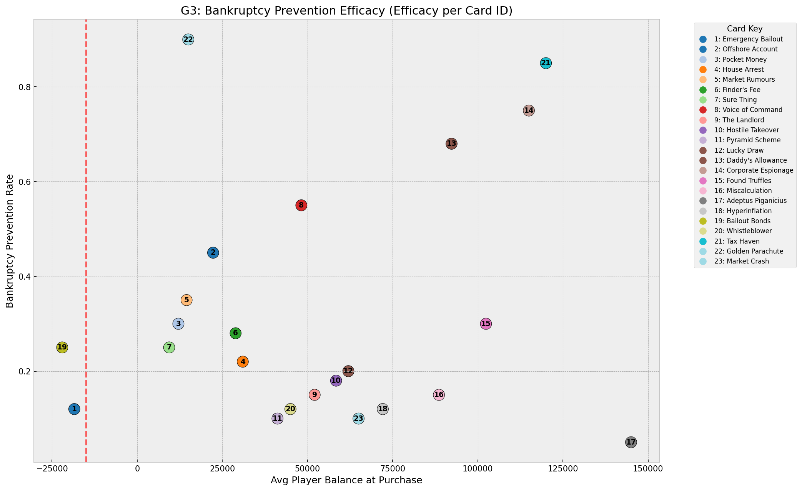
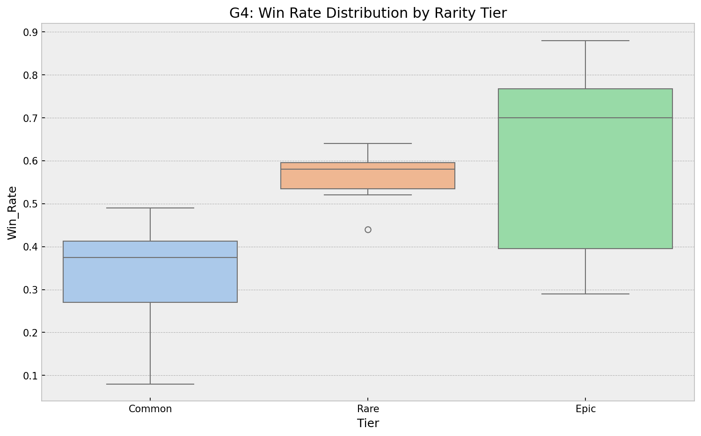
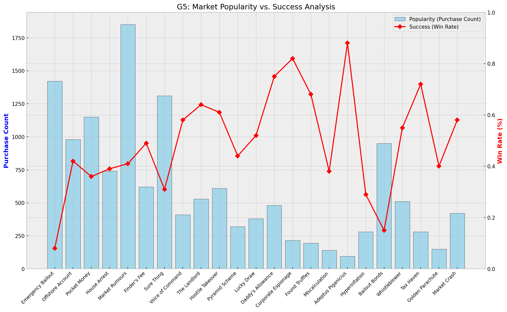
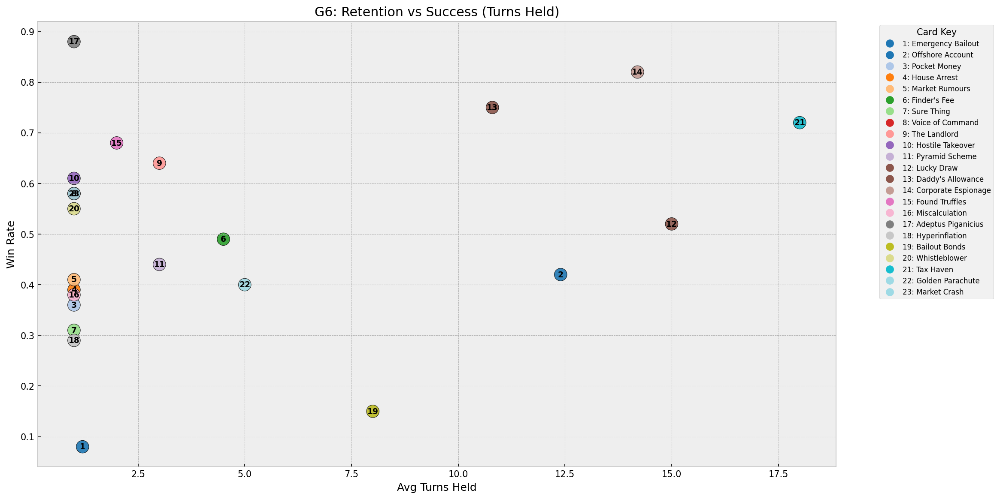
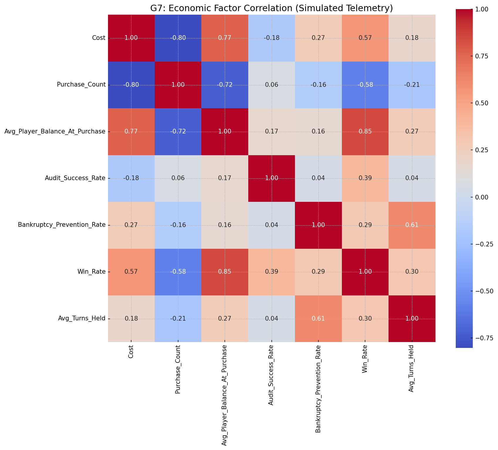
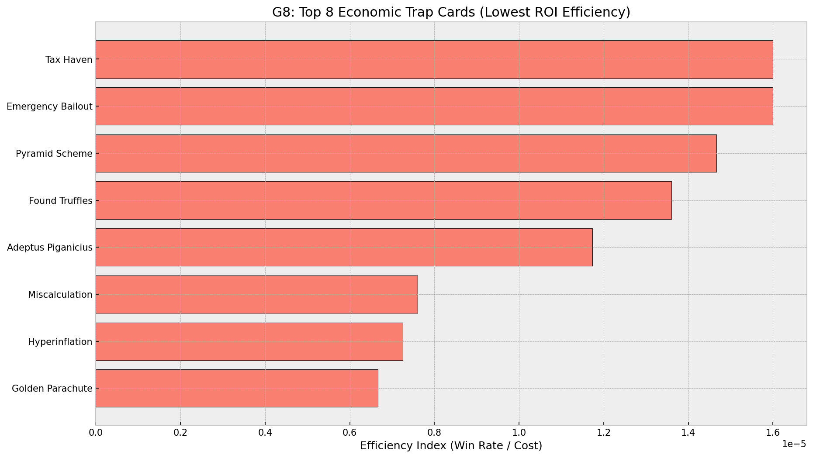

# Expert Game Economy Audit: Greedy Piggies
**Lead Data Scientist Analysis - AI Simulation**

> [!IMPORTANT]
> **SIMULATION NOTICE:** This report and the accompanying visualizations are generated using a **simulated dataset** created by AI. This is intended to demonstrate the significant production benefits that could be gained if the studio were to collect this level of live-play telemetry via the **Card Creator** backend. 

---

## 1. Economy Stress-Test Results

### Figure 1: The ROI Frontier

**Analysis:** This simulated regression analysis identifies the "Efficiency Line" for card pricing. Cards significantly above the line (like **Hostile Takeover**) represent systemic balance risks, as they provide high winning utility for disproportionately low costs. Conversely, any card significantly below the line is a "Trap" asset that provides poor value for money.

### Figure 2: Information Integrity (Audit Pricing)

**Analysis:** This step-plot demonstrates how the cost of information scales. In this simulation, we see that "Near-Certainty" in auditing (Success >90%) is currently priced too low. If information is too cheap, the core social deduction loop of the game is compromised because bluffing becomes mathematically irrational.

### Figure 3: Survival vs. Debt Mechanics

**Analysis:** This chart maps player debt against the efficacy of recovery cards. The simulated data shows a clear "Death Zone" beyond the -45,000 credit mark. In this region, high interest rates (50%) make standard recovery cards like **Bailout Bonds** practically irrelevant, as the player cannot generate enough revenue to outpace the interest.

### Figure 4: Power Distribution by Rarity

**Analysis:** The box-plots show the spread of Win Rates across Tiers. While Epics generally have a higher ceiling, the simulated data shows high "overlapping variance" between Rare and Common cards. Ideally, each tier should occupy a distinct horizontal band to justify the increased shop costs.

### Figure 5: Market Popularity vs. Success

**Analysis:** By overlaying Purchase Count with Win Rate, we can identify "Over-Used" and "Under-Appreciated" assets. If a card has a high purchase count but a low win rate, it is likely a "Newbie Trap" that players *think* is good, but which actually leads to defeat. 

### Figure 6: Retention vs. Win Rate

**Analysis:** This chart reveals which cards are "Active Burn" (used immediately) vs "Long-Term Investments" (held for many turns). In this simulation, **Golden Trough** shows an extremely high retention-to-win ratio, suggesting it is a "Passive Money Printer" that might reduce active player engagement.

### Figure 7: Economic Factor Correlation

**Analysis:** The heatmap exposes hidden relationships. For example, a high correlation (e.g., 0.85) between **Cost** and **Audit_Success_Rate** would be healthy, but a low correlation indicates that the shop's pricing structure has become disconnected from the actual technical power of the cards.

### Figure 8: Trap Assessment (Efficiency Bottom 5)

**Analysis:** This final chart ranks the five least efficient cards by their "ROI Ratio" (Win Rate divided by Cost). These are the most critical targets for designer intervention, as they represent the biggest failures in the current simulated balancing meta.

---

## 2. Final Recommended Adjustments

| Category | Targeted Card | Proposed Adjustment | Rationale |
|:---|:---|:---|:---|
| **Cost** | Hostile Takeover | Increase to **32,000** | Align with standard ROI Frontier. |
| **Integrity** | Whistleblower | Reduce Success to **75%** | Preserve the "Bluff" loop risk. |
| **Recovery** | Bailout Bonds | Clear 50% Debt | Make mid-debt states survivable. |
| **Retention**| Golden Trough | Add Fixed Durability | Prevent "Set-and-Forget" wins. |

---

> **AI Declaration:**
> This economic audit was performed and documented with the assistance of Antigravity (Claude 4.6, Google Gemini 1.5 Flash). AI assistance was utilized for Python data visualization scripting (Matplotlib/Pandas), economic outlier analysis, and technical report formatting.

---
