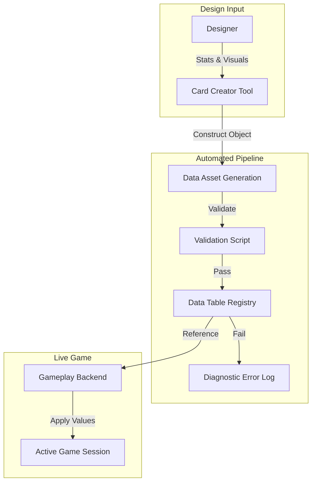

# Production Support Proposal: Card Creator Utility & Asset Pipeline
**To:** Lead Developer  
**From:** Junior Developer (Harry Dillamore)  
**Date:** 24 April 2026  
**Subject:** Scaling and Supporting the 'Card Creator' Production Tool

---

## 1. System Explanation

The **Card Creator** is a technical production service designed to decouple game design from core programming. It is an Unreal Engine 5 Editor Utility that allows designers to define gameplay logic, statistic modifiers, and visual metadata for new cards through a standardized interface. 

The tool serves as a "bridge" between raw design concepts and technical assets. It automates the creation and registration of `UDataAsset` and `UBlueprint` objects, ensuring that all new game content adheres to the project's strict data architecture without requiring manual code entry or risk of merge conflicts.

## 2. Technical Stack

To support this tool in a professional production environment, the following stack is required:

*   **Host Software:** Unreal Engine 5.4+ (Editor Utility Widget framework).
*   **Data Integrity:** Unreal **Data Tables** and **Data Assets** for structured storage.
*   **Serialization:** JSON or CSV for external auditing and web-portal integration.
*   **Version Control:** Git LFS or Perforce to manage the binary assets generated by the tool.
*   **Automation:** Python for Unreal (Scripting automated asset verification).

## 3. Infrastructure & Deployment Requirements

*   **Testing Environment:** A dedicated "Testing World" within the project to verify that assets generated by the tool trigger correct gameplay events (Audit checks, score multipliers).
*   **Build Automation:** A CI/CD pipeline (GitHub Actions) to run validation scripts on any assets created by the tool to ensure they won't break the build.
*   **Maintenance Lab:** A centralized repo location for designers to pull the latest version of the tool without needing to pull the entire game logic codebase (Modular repo structure).

## 4. Estimated Costs (Baseline: In-Editor Utility)

| Item | Initial Setup (USD) | Ongoing Costs (Monthly USD) |
|:---|:---|:---|
| **Version Control Hosting** | $0 | $0 - $20 (Hosting the tool repository) |
| **CI/CD Unit Testing** | $0 | $0 (Free tier GitHub Actions minutes) |
| **Tool Documentation** | $0 | $0 (Internal Wiki/Readme) |
| **Maintenance** | N/A | ~5-10 hours/month (Dev support) |
| **TOTAL** | **$0** | **$0 - $20** |

## 5. Target Platforms

*   **Primary:** Unreal Engine Editor (Windows).
*   **Output Support:** All game target platforms (PC, Steam Deck, Consoles) consume the Data Assets generated by the tool.

## 6. System Functionality Diagram

*Figure 1: Proposed Production Data Pipeline for the Card Creator tool.*

## 7. Future Development: Cloud-Based Design Portal

To support remote work and rapid balancing, we propose a web-based extension of the **Card Creator**.

### Features:
*   **Web Form Entry:** Designers can balance cards via a standard web browser (Node.js/Firebase).
*   **Headless Processing:** A cloud-based Unreal Engine instance pulls the web-data and generates assets automatically, pushing them to the primary developer branch.
*   **Live-Config Support:** Pushing balance updates directly to connected players without a full client-side patch.

### Cloud Implementation Costs:

| Item | Setup (USD) | Ongoing (Monthly USD) |
|:---|:---|:---|
| **Web Infrastructure** | $0 | $0 - $20 (Vercel/Firebase) |
| **Automated Compute** | $0 | $15 - $30 (Headless generation time) |
| **Domain/API** | $15 | $0 |
| **TOTAL** | **$15** | **$15 - $50** |

---

> **AI Declaration:**
> This production proposal was drafted with technical assistance from Antigravity (Claude 4.6, Google Gemini 3 Flash). 

---
