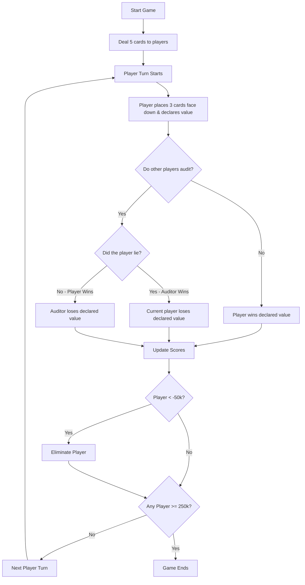
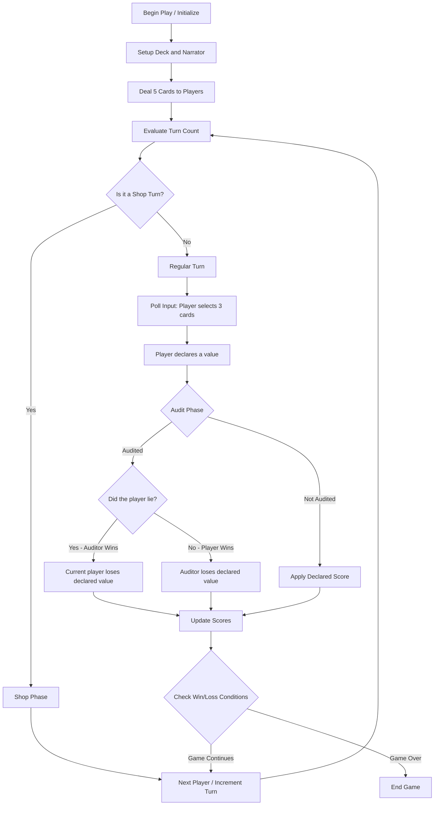
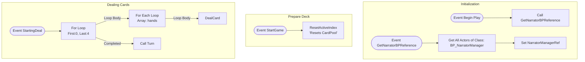
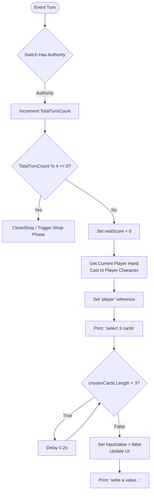
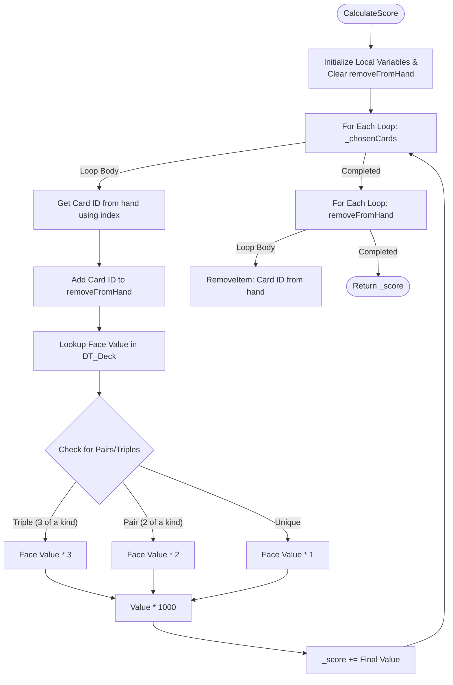

# Greedy Piggies Development Commentary

**Unit Name:** [Insert Unit Name]

**Student Name:** Harry Dillamore

**Student ID:** 2402521

**Total Word Count:** [XXXX] _(Assuming ~2000 words for the targets below)_

**API Reference Link:** [URL]

**User Guide Link:** [URL]

**Build Link:** [URL or Embed]

**Video Demonstration Link:** [URL or Embed]

---

## Abstract _(Approx. 5–10% | ~100–200 words)_

[Summarise your task, goals, approach, and final outcome. What was the intent of your work? What is the most important thing to know before reading on? e.g. Core systems loop, Card Creator tool, Git management.]

---

## Research _(Approx. 20-30% | ~400–600 words)_

### What sources or references have you identified as relevant to this task?

[Reflect on the type and relevance of sources explored. Justify your research direction in relation to the task brief and target outcomes.]

My research validates the **interdependence of technical stability and player psychology**. I focused on proving that data-driven architecture is the industry standard for reducing production friction, while grounding the "Audit" mechanic in game theory to ensure the loop remains engaging.

- **Explored:** **Official engine documentation** to justify technical implementation and **peer-reviewed papers** to validate the "suspense" factor. I included a **commercial case study** to analyze state machine transitions.
- **Avoided:** Hobbyist blogs and YouTube tutorials. These lack the authoritative weight required for university-level architecture and often promote "spaghetti" logic that ignores scalability.
- **Outcomes:** This research ensures the experience is "fair" (via theory) and the technical approach is "scalable" (via data-driven design), meeting both creative and professional production aims.

---

#### Source 1: Academic (Game Theory)

Li, Zhao, and Wang’s study on **imperfect-information games** is highly relevant as it mathematically defines why "bluffing" is a structural necessity to prevent a "solved" (and boring) meta.

- **Strategic Unpredictability:** I learned that without an audit mechanic, games become "exploitable," where players with the best cards always win.
- **Information Asymmetry:** The paper's "Bayesian probabilistic model" informed my UI—giving players enough info for a "calculated" audit.
- **The Cost of Deception:** Analyzing "Counterfactual Regret Minimization" helped me balance the penalties for failed bluffs.

**Evaluation:** This source provides a mathematical backbone for "fun." Its limitation is the focus on AI; I had to translate its "Nash Equilibrium" findings into rules that feel intuitive for human players.

---

#### Source 2: Game Source (Case Study)

_Liar’s Bar_ mirrors the core "Audit" and "Betting" mechanics of my project. Analyzing its success provides a blueprint for how state machines facilitate complex human interaction.

- **State Machine Transitions:** I analyzed the transition between "Card Play" and "Reaction." _Liar's Bar_ uses forced delays to build tension, which I replicated in my loop.
- **Visual Feedback:** The game uses high-stakes animations to signal a round's end, teaching me that the "Audit" requires a distinct "Reveal Phase."
- **Network Sync:** I studied its server-authoritative checks to ensure all clients see the same "truth" simultaneously.

**Evaluation:** Excellent for UI/UX inspiration. However, as an Early Access title, its handling of technical edge cases is still evolving, requiring me to cross-reference with official documentation.

---

#### Source 3: Technical Documentation

This is the official technical standard provided by the creators of Unreal Engine. It details the intended use of `UDataAsset`, `FStruct`, and `UDataTable`.

- **Decoupling:** The documentation confirms that moving card stats into **Data Assets** is the "correct" way to prevent Git merge conflicts.
- **Efficiency:** I learned how `UDataAsset` handles asynchronous loading, ensuring performance remains stable as the library scales.
- **Tooling:** This provided the API references needed to build the **Card Creator** tool using Editor Utility Widgets.

**Evaluation:** This is my most vital source. It architecturally proves that my "Card Creator" is an industry-standard optimization that ensures project stability as the team grows.

---

### Bibliography

Curve Animation (2024) _Liar's Bar_. [Video game]. PC: Curve Animation.

Epic Games (2026) _Data-Driven Gameplay Elements_. Available at: [https://dev.epicgames.com/documentation/en-us/unreal-engine/data-driven-gameplay-in-unreal-engine](https://www.google.com/search?q=https://dev.epicgames.com/documentation/en-us/unreal-engine/data-driven-gameplay-in-unreal-engine) (Accessed: 19 April 2026).

Li, S., Zhao, Y. and Wang, X. (2024) ‘Analysis of Bluffing by DQN and CFR in Leduc Hold’em Poker’, _arXiv_, 2401.08522v1 [cs.GT]. Available at: [https://arxiv.org/abs/2401.08522](https://arxiv.org/abs/2401.08522) (Accessed: 19 April 2026).

#### Sources

[For each source (at least 1 game, 1 documentation, 1 academic), provide an opening paragraph, a bullet list of what you learned, and a closing paragraph evaluating it.]

---

## Implementation _(Approx. 30–40% | ~600–800 words)_

### What was your development process and how did decisions evolve?

[Describe your technical and creative approach: Planning, ideation, iteration (e.g. gameplay loop flowchart). Include feedback from the design team on the Card Creator and how it was integrated.]

### What creative or technical methods did you try?

[Discuss the Data Assets/Structs implementation for the Card Creator to prevent Git conflicts. Include evidence like blueprints/code snippets.]

### Did you experience any technical challenges?

[Discuss roadblocks with multiplayer networking, the "audit" state management, or resolving complex Git conflicts. Include before/after screenshots of code.]

---

### Initial Prototyping

- For the initial prototyping phase, I focused on creating a simple, functional version of the game loop.
- I made a simple version of the game using barebones visuals and inputs to test the core mechanics.

- here is a graph of the plan for the game loop:

- I formatted the assets so that each play would create a 'hand' object, which is then used to contain key data: the cards currently in their hand and their total score.
- I chose to do this because it would make it easier to reference these key values. Every player has a hand, and every hand contains their cards and their score
- I did this to make the design more robust and scalable. meaning that if we wanted to have different kinds of characters, all they need is a new hand object and then most of the data would be in place.
- I also created custom events for adding and removing data from the hand object.
- This meant that other people working on the project had an easy way of adding and removing cards from a player's hand without having to worry about the underlying data structure.

- I used this setup to create simple AI opponents that had all the data needed and would make randomised decisions in order to do rapid testing of the game loop.
- I handled the AI decisions in the dealer blueprint because it was the easiest solution at the time, as the AI were not planned to be a permanent feature of the game.
- below is a diagram of the logic for the AI picking random cards in their hand to play:

- I chose to spend time making the AI opponents because we had discussed that the multiplayer implementation was going to take a long time as it was a new system for the team to learn.
- This meant that we would be unable to test any of the features of the game until the multiplayer was implemented.

### Dealer Actor Logic

**Dealer Actor Overview**
This is the actor which is responsible for dealing cards to the players and handling the majority of the game logic. I chose to put the logic in a single authoritative actor to make it easier to manage and debug the game logic.

- The logic is split up into many custom events to make it easy to trigger different parts of the game loop.
- I attempted to migrate the logic to components to make it easier to involve more people working simultaneously; however, this was not successful because I could not get people to consistently work like this. Since not enough people were actively working on the logic of the game, it was not worth the time investment.

#### Start Game

This section manages the setup of the game, taking place across three main execution paths:

**1. Initialization (BeginPlay)**
On `BeginPlay`, the Dealer triggers `GetNarratorBPReference`. This searches the level using `GetAllActorsOfClass` to find the `BP_NarratorManager` and caches a reference to it in `NarratorManagerRef` so it can be easily accessed throughout the game without performance overhead.

**2. Game Reset (StartGame)**
The `StartGame` custom event is executed to initialize a session. It strictly calls `ResetActiveIndex`, which readies a fresh Card Pool for the game.

**3. Dealing Phase (StartingDeal)**
The `StartingDeal` event handles dispensing the initial hands to all players. It runs a `For Loop` five times (indices 0 to 4). During each of the 5 iterations, a nested `For Each Loop` iterates through the `hands` array (containing all active player hands) and executes `DealCard` to give every player one card at a time. Once the outer loop finishes dealing 5 cards to everyone, it fires the `Turn` function to officially begin gameplay.

#### Turn

This section manages the individual player progression and handles the input polling at the start of a turn:

**1. Turn & Shop Tracking**
When the `Turn` event fires, the server (via a `Switch Has Authority` check) increments the `TotalTurnCount`. It uses a modulo operation (`TotalTurnCount % 4 == 0`) to determine if it is time for a Shop Phase or a Regular Turn. (As per the design, a shop phase occurs periodically).

**2. Turn Initialization**
If it is a Regular Turn, the system sets up the state by resetting the `realScore` to 0. It determines the active player by grabbing the current hand, casting it to the character (`BP_FirstPersonCharacter_HarryTesting`), and caching this as the `player` variable.

**3. Input Polling**
With the player referenced, it prints "select 3 cards" to the screen. It then enters an input polling loop using a 0.2-second `Delay` to repeatedly check if the length of the `player.chosenCards` array is less than 3.

**4. Value Declaration Prep**
Once the player has selected 3 cards, the loop breaks. The sequence moves to prepare for the value declaration: it resets the player's input state (`inputValue = false`), toggles some UI element visibility (`SetVisibility`), and prompts the player to "write a value or type 0 to tell the truth" on the screen.

### Auditing

I created a simple auditing system that would allow players to audit each other's declarations.

- to begin with

- The player chooses their 3 cards to player face down
- The player then declares the value of their cards
- The game then checks if the declaration is true or false
- If the declaration is true and they are not audited, the player wins the declared value
- If the declaration is false and they are not audited the player loses the declared value
- If the declaration is true and they are audited the auditor loses the declared value
- If the declaration is false and they are audited the player loses the declared value

- for the prototype, I used print strings to display the prompts for the user and used key pressed events to handle the inputs
- on the players turn, the game would print the prompts to the console and wait for the player to enter a value of the audit
- The AI would all make a random decision on whether to audit or not, and would print their decision to the console
- when the player has a decision to audit, the game would print a prompt asking them to audit or not by pressing 'y' or 'n'
- at this stage, the game would ask each player in turn if they wanted to audit or not
- when someone chose to audit, the game stops taking inputs from the rest of the players and runs the audit calculations
- below is the logic for asking each player if they wanted to audit or not:
- it uses a recursive algorithm to loop through each player and wait for their input before moving to the next
- This is not the most efficient way to handle this, but for a temporary proof of concept it was the fastest way to get something functional that we could test

### Card Setup

- the cards are stored in a data table which contains the index, the value, the suit and the image path
- the data table is static and does not change throughout gameplay
- an array stores the index of cards that are currently in play and when the data is needed it is fetched from the data table
- this means that the data is never modified in ways it shouldnt be
- also simplifies the process of getting cards as there is just one array of integers that has to be handled rather than multiple arrays of different data types
- below is the data table for the cards:

### Score Calculation

- the score is calculated based on the cards that are played
- the cards are worth 1000x their face value
- duplicates double the worth of both cards
- sets of three are worth 3x the value of the cards
- the game calculates the score so that it can check if players are telling the truth or not
- the calculation has to take into account the multiplier for duplicates and sets of three

### Multiplayer

- Multiplayer implementation is something I have not done in any capacity before this project.
- Me, Bradley, and Josie had to do a lot of research into how to implement multiplayer in Unreal Engine.
- We used paired / group programming to work on this aspect of the project. This is a well-documented technique often used in software engineering to help teams work together more effectively, and we benefited from bouncing ideas off each other when we got stuck.
- The task still took us a long time and involved moving many things from running on the client to running on the server.
- **Server Authority:** Critical logic, such as incrementing the `TotalTurnCount` or handling turn transitions, relies on `Switch Has Authority` checks. This guarantees that only the server handles the game state transitions, which prevents malicious clients from manipulating the turn order.
- **Remote Procedure Calls (RPCs):** The Dealer actor takes advantage of distinct custom events acting as network boundaries:
  - `ServerIsAuditing`: A Run-On-Server RPC utilized during the auditing phase. This event allows a connected client to securely transmit their individual audit decision to the authoritative server, passing their `PlayerIndex` and an `Auditing` boolean.
  - `UpdateAllScores`: A Multicast/Server-driven RPC that ensures once the server finalizes an audit or score check, the correct score array is pushed to all remote clients, keeping UI data perfectly synchronized across all players.

### Card Creator

- The card creator is a tool that was created to help designers create cards for the game.
- it is a widget that allows designers to enter data for a card and then save it, which creates a data asset and an empty blueprint for the card logic to be put into
- a referance to the asset is then put into an array containing all of the shop cards
- I have used a blueprint interface to create a system where the same event can be called for each card, but the logic can be different for each card
- this means that any card can be called from the central array and the logic will all be called in the same way

---

## Testing _(Approx. 10–15% | ~200–300 words)_

### What testing methods did you use?

[Detail the testing conducted for the tools (e.g., designers using Card Creator) and the game loop. Include a testing table, screenshots, bugs found, and how testing influenced the final result.]

---

## Critical Reflection _(Approx. 10–15% | ~200–300 words)_

### What went well?

[Reflect on successes: Which aspects of the Card Creator and the gameplay loop are you most proud of? Did it successfully fix the pipeline bottlenecks?]

- **Card Creator Success**: Successfully mitigated pipeline bottlenecks by allowing designers to create abilities via the Editor Utility Widget without touching code, eliminating Git merge conflicts by cleanly separating design variables into Data Assets.
- **Multiplayer Milestone**: Establishing a stable server-authoritative frame for an entirely new discipline was a major win. Utilizing group/pair programming helped us overcome replication hurdles and effectively secure our RPCs.
- **Rapid Prototyping**: Developing the basic procedural AI allowed us to bypass the multiplayer delays and immediately test the "bluffing" game theory mechanics to validate the fun factor.

### What could be improved or done differently next time?

[Reflect on what didn't work. What systems felt clunky? If you had another month, what would you rewrite or change?]

---

## Bibliography

[Use UCA's Harvard Referencing Format. Example: Rollings, A. and Adams, E. (2003) *Andrew Rollings and Ernest Adams on Game Design*. New Riders Publishing.]

---

## Declared Assets

[List third-party assets, tutorial code snippets, UI packs, or AI-generated scripts/content.]
