# Greedy Piggies Development Commentary

**Unit Name:** [Insert Unit Name]

**Student Name:** Harry Dillamore

**Student ID:** 2402521

**Total Word Count:** [XXXX] _(Assuming ~2000 words for the targets below)_

**API Reference Link:** [URL]

**User Guide Link:** [URL]

**Build Link:** [URL or Embed]

**Video Demonstration Link:** [URL or Embed]

---

## Abstract

This commentary documents my contributions as a developer on _Greedy Piggies_, a multiplayer card game developed in Unreal Engine 5 as part of a group project, with the goal of a commercial release on Steam. The game is a bluffing and betting card game for 2–4 players, in which each player places cards face-down, declares a score value, and then faces the risk of being audited by their opponents. If an auditor successfully catches a bluff, the active player loses their declared value; if the challenge fails, the auditor pays the penalty instead. Players also periodically visit a shop to purchase special ability cards, adding a strategic layer to the core loop. My primary responsibilities spanned the full backend of the game: designing and implementing this core gameplay loop, developing the turn and audit systems, integrating Steam-based multiplayer networking, and building a bespoke **Card Creator** tool to support the design pipeline. The Card Creator, implemented as an Editor Utility Widget, was specifically intended to reduce production bottlenecks by allowing designers to create and register special ability cards independently, without requiring direct programmer involvement. Underpinning all systems is a data-driven architecture using Unreal's Data Tables and Data Assets, which ensured clean version control and prevented merge conflicts as the team scaled. Whilst the final game did not reach the level of polish originally intended, the core systems—including the gameplay loop, data architecture, and multiplayer integration—functioned as designed and represent the primary focus of this write-up.

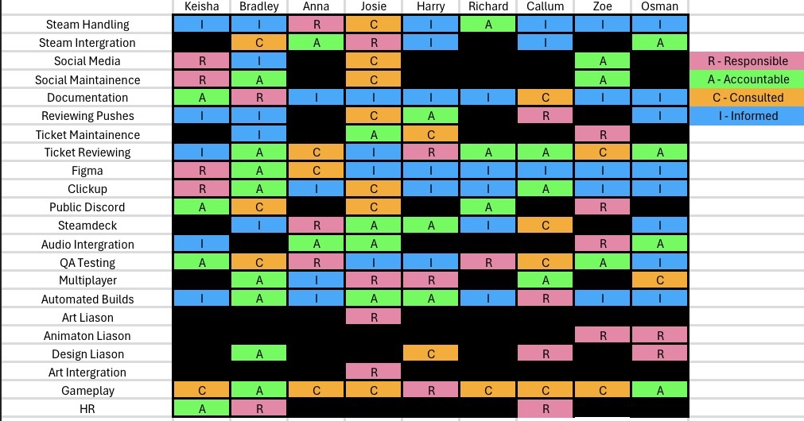

---

## Research

My research validates the **interdependence of technical stability and player psychology**. I focused on proving that data-driven architecture is the industry standard for reducing production friction, while grounding the "Audit" mechanic in game theory to ensure the loop remains engaging.

- **Explored:** **Official engine documentation** to justify technical implementation and **peer-reviewed papers** to validate the "suspense" factor. I included a **commercial case study** to analyze state machine transitions.
- **Avoided:** Hobbyist blogs and YouTube tutorials. These lack the authoritative weight required for university-level architecture and often promote "spaghetti" logic that ignores scalability.
- **Outcomes:** This research ensures the experience is "fair" (via theory) and the technical approach is "scalable" (via data-driven design), meeting both creative and professional production aims.

---

#### Source 1: Academic (Game Theory)

Li, Zhao, and Wang’s study on **imperfect-information games** is highly relevant as it mathematically defines why "bluffing" is a structural necessity to prevent a "solved" (and boring) meta.

- **Strategic Unpredictability:** I learned that without an audit mechanic, games become "exploitable," where players with the best cards always win.
- **Information Asymmetry:** The paper's "Bayesian probabilistic model" informed my UI—giving players enough info for a "calculated" audit.
- **The Cost of Deception:** Analyzing "Counterfactual Regret Minimization" helped me balance the penalties for failed bluffs.

**Evaluation:** This source provides a mathematical backbone for "fun." Its limitation is the focus on AI; I had to translate its "Nash Equilibrium" findings into rules that feel intuitive for human players.

---

#### Source 2: Game Source (Case Study)

_Liar’s Bar_ mirrors the core "Audit" and "Betting" mechanics of my project. Analyzing its success provides a blueprint for how state machines facilitate complex human interaction.

- **State Machine Transitions:** I analyzed the transition between "Card Play" and "Reaction." _Liar's Bar_ uses forced delays to build tension, which I replicated in my loop.
- **Visual Feedback:** The game uses high-stakes animations to signal a round's end, teaching me that the "Audit" requires a distinct "Reveal Phase."
- **Network Sync:** I studied its server-authoritative checks to ensure all clients see the same "truth" simultaneously.

**Evaluation:** Excellent for UI/UX inspiration. However, as an Early Access title, its handling of technical edge cases is still evolving, requiring me to cross-reference with official documentation.

---

#### Source 3: Technical Documentation

This is the official technical standard provided by the creators of Unreal Engine. It details the intended use of `UDataAsset`, `FStruct`, and `UDataTable`.

- **Decoupling:** The documentation confirms that moving card stats into **Data Assets** is the "correct" way to prevent Git merge conflicts.
- **Efficiency:** I learned how `UDataAsset` handles asynchronous loading, ensuring performance remains stable as the library scales.
- **Tooling:** This provided the API references needed to build the **Card Creator** tool using Editor Utility Widgets.

**Evaluation:** This is my most vital source. It architecturally proves that my "Card Creator" is an industry-standard optimization that ensures project stability as the team grows.

---

#### Source 4: Industry Insight (Workflow & Maintenance)

The Outscal technical blog addresses the specific friction points of large-team development, specifically regarding Blueprint maintenance.

- **Modular Logic:** I analyzed the importance of "Blueprint Function Libraries" to ensure logic is reusable, preventing redundant code across the team.

- **Conflict Mitigation:** The source highlights that because Blueprints are binary files, moving variable data into Data Assets is essential for parallel workflow.

- **Encapsulation:** I learned that keeping logic "Private" within the state machine prevents accidental breaks by other developers.

**Evaluation:** This source identifies the "human element"—how teams break projects. It provides a practical "Standard Operating Procedure" that ensures the codebase remains maintainable.

---

## Implementation

### Initial Prototyping

During the initial prototyping phase, the primary focus was on establishing a functional version of the game loop. To achieve this quickly, I utilized barebones visuals and inputs, allowing the team to test the core mechanics without being hindered by polished art or complex UI.

The core flow of this loop is detailed in the flowchart below:

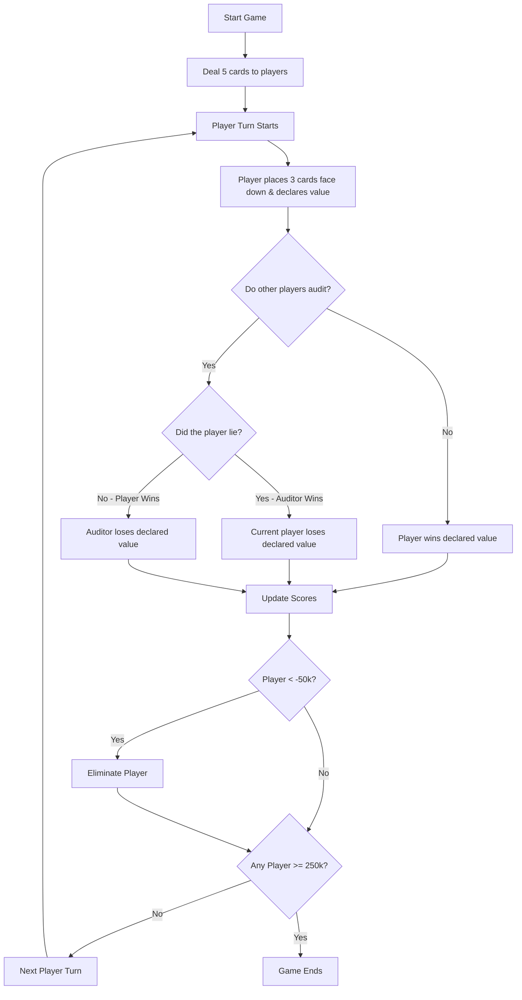

To support this loop, I formatted the assets such that each player instantiation would create a distinct "Hand" object. This foundational object acts as a localized data container, storing the cards actively held by the player and their total running score. By centralizing this data into a specific object, the logic pipeline became much more robust and scalable. For instance, testing diverse character variants became a streamlined process; introducing a new character merely required assigning them a new Hand object, as the underlying architecture was already modular.

Furthermore, I grouped logic using standard `Custom Event` nodes to manage adding and removing data from the Hand object. This was an essential design decision that provided team members an accessible interface to manipulate a player's hand state via standardized array execution paths (utilizing `Add` and `Remove Item` array nodes), without requiring them to parse or modify the underlying variable structures directly.

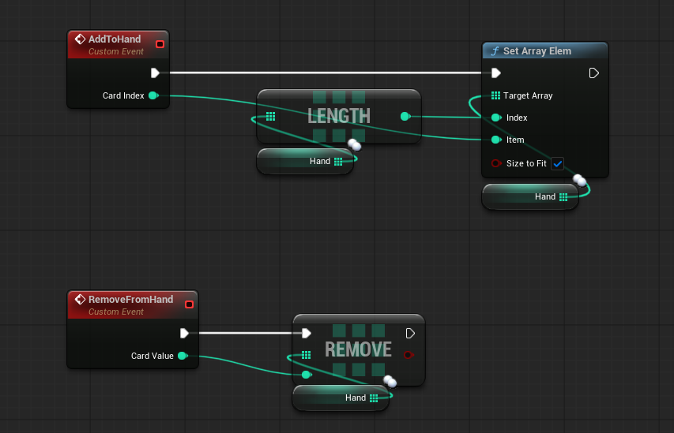

This clean data access allowed me to rapidly implement simple AI opponents to facilitate loop testing. While incorporating AI was initially seen as a secondary task, we had identified that proper multiplayer implementation would take substantial time for the team to learn and integrate. Without AI, testing the gameplay would be stalled until the network architecture was finalized. By building rudimentary AI directly into the Dealer blueprint, we unblocked our rapid iterations, even though these AI routines were not intended for the final release.

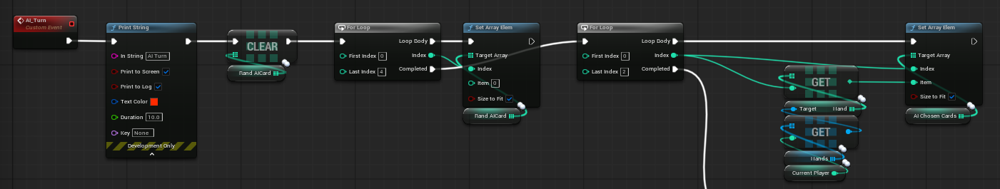

### Dealer Actor Logic

The Dealer actor functions as the authoritative controller for the game, responsible for allocating cards to players and managing the bulk of the overarching turn logic. Centralizing this logic into a single authoritative actor was a conscious choice to simplify tracking state and streamline debugging in a multiplayer environment.

While I initially attempted to migrate this logic out into separate components—thereby theoretically allowing multiple team members to work on the logic simultaneously—this approach was ultimately abandoned. The team struggled to adapt to a component-based workflow, and since there was a limited number of developers actively programming the central game loop, the organizational overhead of component routing outweighed the benefits.

Instead, the logic remains effectively segmented across numerous discrete custom events, allowing elements of the game loop to be triggered cleanly.

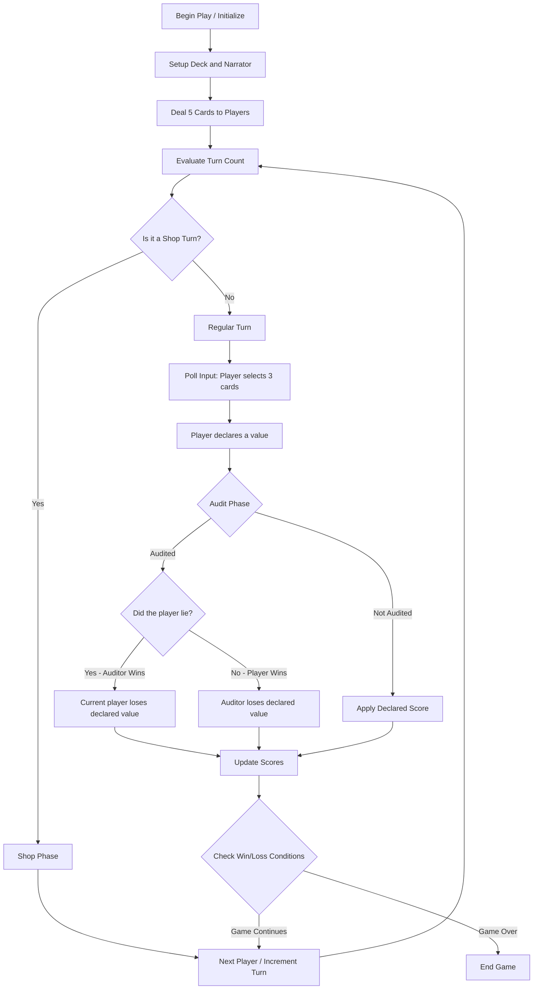

#### Start Game

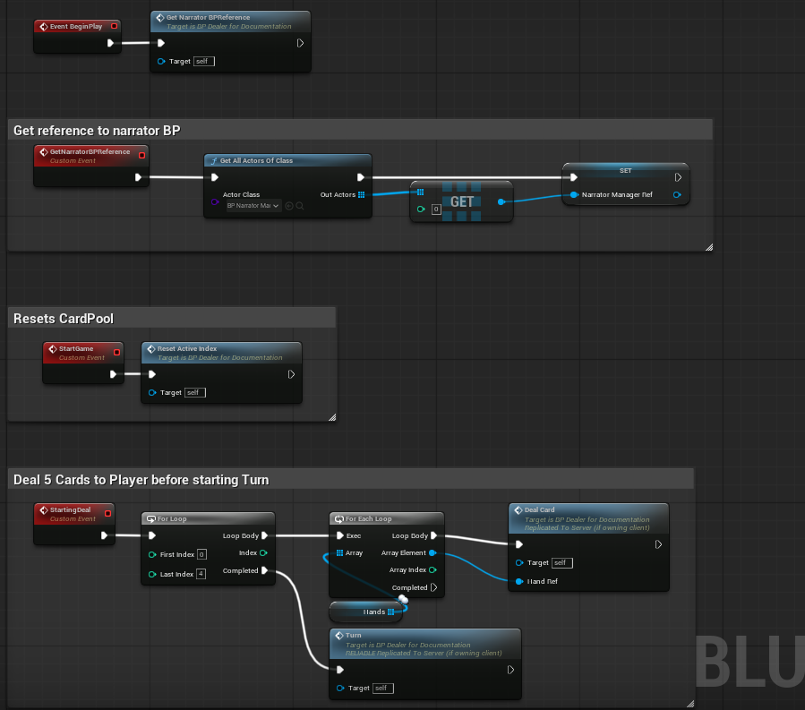

The sequence for initiating a game session dictates three critical paths:

1. **Initialization (BeginPlay):** Upon the game starting, the Dealer's `Event BeginPlay` node triggers the `GetNarratorBPReference` custom event. This utilizes the `Get All Actors Of Class` node to locate the `BP_NarratorManager` and connects to a `Set` node to securely cache a reference to it in the `NarratorManagerRef` variable. Caching this on initialization prevents the performance tax of dynamically searching for the narrator throughout active gameplay.
2. **Game Reset (StartGame):** The `StartGame` custom event acts as a session initialize, executing `ResetActiveIndex` to safely clear and prepare a fresh localized Card Pool.
3. **Dealing Phase (StartingDeal):** This event is responsible for dispensing the initial set of cards to all active players. By executing a primary `For Loop` macro node five times, and nesting a secondary `For Each Loop` node that cycles through the `hands` array (utilizing a `Get` node to access specific player Hands), the `DealCard` function iteratively distributes starting cards exactly as a physical dealer would interactively dispense them. Following the completion of this dealing sequence, the primary `Turn` function is called to begin the game cycle.

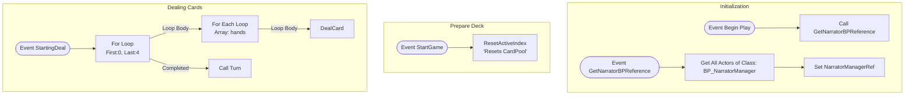

#### Turn

The Turn system orchestrates the input polling pipeline and individual player progression step-by-step:

1. **Turn & Shop Tracking:** When triggered, the `Turn` custom event utilizes a Server check via the `Switch Has Authority` macro to safely increment `TotalTurnCount`. A `Modulo (%)` math node paired with an `Equal (==)` integer check controls the integration of the supplementary Shop Phase gracefully between standard turns.
2. **Turn Initialization:** On a standard turn, the active player's context is established. The current target hand is grabbed via a `Get` copy, successfully validated and cast using a `Cast To BP_FirstPersonCharacter` node, and cached as `player` securely via a `Set` node. The turn's real localized score parameters are reset to zero.
3. **Input Polling:** A visual prompt reading "select 3 cards" is dispatched. Subsequently, an input polling loop introduces an intentional 0.2-second `Delay` node to seamlessly wait. The loop conditionally checks the `Length` of the `player.chosenCards` array against a `Less (<)` integer math node to break only when precisely 3 cards register.
4. **Value Declaration Prep:** Upon validation, the gating loop ceases via a `Branch` node's True execution logic. The player's core input framework locks temporarily by Setting `inputValue = false`, and execution moves to a `Set Visibility` node to highlight the next mandatory phase, commanding the user through a `Print String` node to declare the actual or deceptive value of their hand.

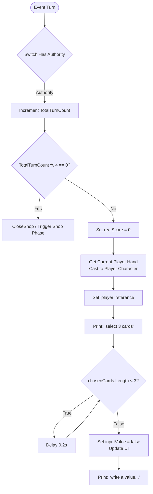

### Auditing

To introduce a strong element of game theory and bluffing, an intricate auditing system was devised where players can formally challenge each other's score declarations. The core sequence of interactions proceeds as follows:

1. The active player confidentially selects 3 face-down cards to place in the center field.
2. The player publicly declares the combined score value of these cards.
3. Regardless of the declaration, the game's authoritative state internally evaluates the truthful mathematical outcome of the physical cards submitted.
4. If a player submits a truthful declaration and remains unaudited, they naturally win their declared sum. Conversely, a deceitful declaration that goes unaudited will cost them their falsely claimed value.
5. If the player is successfully audited, a conflict emerges: an honest active player will cause the accusing auditor to lose the claimed value as a penalty. A dishonest active player, successfully caught in a bluff by an auditor, suffers the penalty themselves.

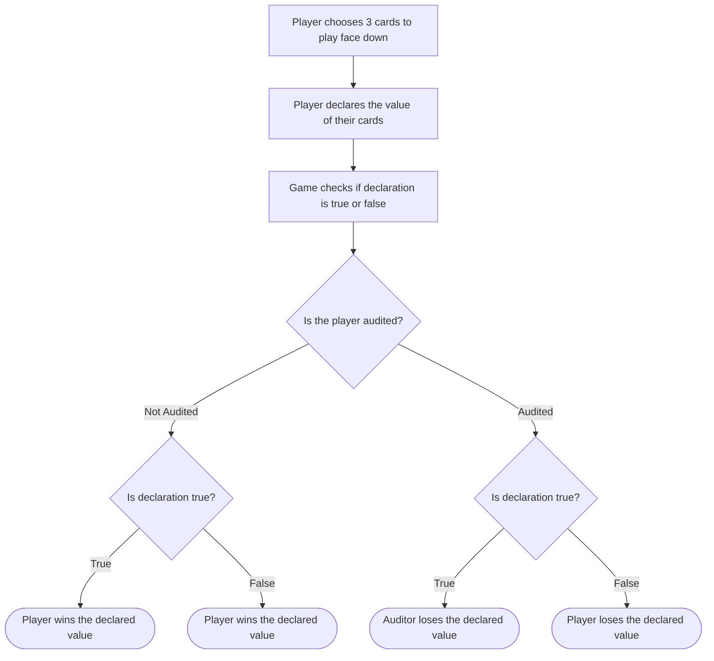

For testing the prototype, inputs and prompts were routed explicitly through localized `Print String` nodes combined with basic Key Event nodes mapping out "Y" or "N" decisions directly down the sequential player order. AI characters integrated into the prototype would procedurally resolve an audit determination via a `Random Integer in Range` node and evaluate the outcome securely via `Branch` logic checks before printing the choice to visually confirm functionality.

The logic operates recursively: utilizing a `Sequence` execution node framework, it systematically asks each player their intent, relying on the input graph to poll their keyboard event before proceeding to the subsequent target. Should any single participant choose to initiate an audit, the query loop instantly breaks, blocking following players from further interface events (using a `Disable Input` node) and transitioning immediately into finalizing the audit math sequence. This recursive event-block system, despite not being perfectly optimized, was the most direct solution to actualize a playable proof-of-concept.

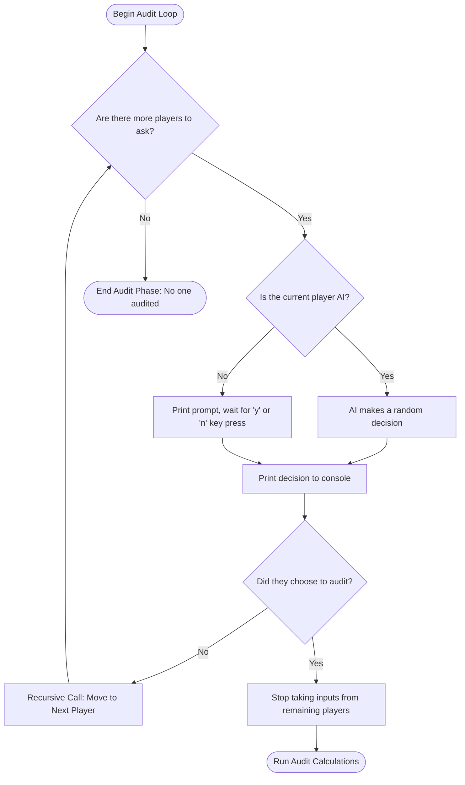

### Card Setup

In pursuit of data integrity, card configurations—such as values, suits, visual paths, and respective index IDs—are hardcoded into an Unreal Data Table. Utilizing a Data Table provides a static framework guaranteed against unexpected runtime mutations.

Therefore, actively dealt cards are handled strictly via corresponding integer indexes managed cleanly in a basic array. Whenever a system needs to identify graphic metadata or value strings, the script explicitly uses a `Get Data Table Row` node to query the Data Table securely. Utilizing a `Break` node on the output struct provides exact access to the desired fields, eliminating convoluted variable clusters holding assorted disparate data types.

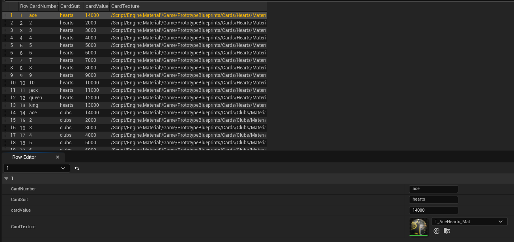

### Score Calculation

Scores calculate directly against the real values queried from the static Data Table via the previously mentioned `Get Data Table Row` nodes. Baseline point distributions execute by combining a `Get` node function with an Integer `Multiply (*)` node, systematically multiplying a card's face value by 1000. Subsequent combo modifiers apply multiplicatively dictating routing via `Branch` and `Switch on Int` sequences: an identical pair generates double their standard baseline, whereas an identical set of three produces triple the baseline output.

The authoritative calculation must run comprehensively behind the scenes regardless of player intent; otherwise, validating an auditor's success rate would remain impossible safely verify.

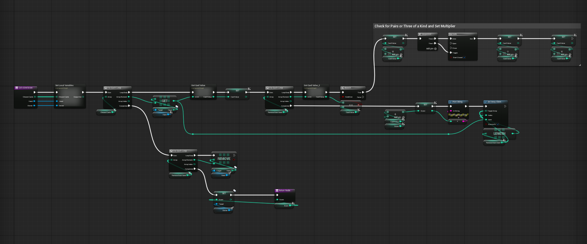

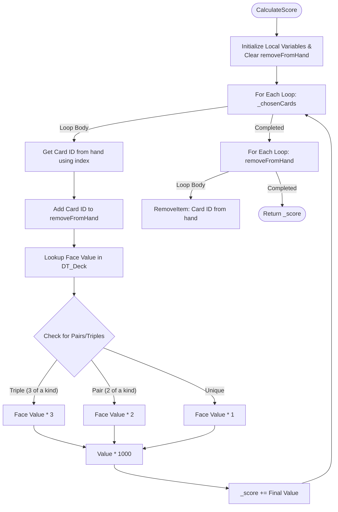

### Multiplayer

Developing true multiplayer logic was a significant milestone, primarily because creating networked gaming applications was an entirely novel discipline for myself prior to the project. Consequently, an expansive degree of preliminary research was necessary, performed collaboratively alongside Bradley and Josie.

To mitigate our mutual unfamiliarity with Unreal Engine's replication paradigms, we adopted paired and group programming frameworks dynamically to unblock each other when confronted with severe networking issues. This well-documented software engineering technique proved incredibly valuable in establishing rapid knowledge exchange and ensuring we maintained operational cadence as a collective team. Overall, transitioning the monolithic framework to utilize Server-client procedures represented an immense undertaking involving shifting substantial workloads from the end user to the server's jurisdiction securely.

- **Server Authority:** Resolving game-critical parameters—such as manipulating the `TotalTurnCount` or governing cyclic turn boundaries—currently predicates exclusively upon `Switch Has Authority` implementations. Utilizing this macro safely ring-fences our game flow execution uniquely to the Server architecture, guaranteeing malicious or out-of-sync clients remain mathematically unable to unilaterally exploit cycle sequences.
- **Remote Procedure Calls (RPCs):** To pass input over boundaries back to the authoritative environment safely, the central Dealer blueprint employs specific, targeted Custom Events structured as Remote Procedure Calls:
  - `ServerIsAuditing`: Constructed structurally as a Run-On-Server RPC, this event serves specifically to empower connected clients navigating their customized Audit Phase prompts to submit asynchronous decisions securely upwards, sending their explicit `PlayerIndex` paired tightly with an `Auditing` truth flag safely to the game master.
  - `UpdateAllScores`: Organized equivalently as a Server-driven or Multicast RPC configuration, this logic ensures that upon the definitive conclusion of the rigorous audit math resolution steps, an authenticated, universal copy of the final player scores is replicated to all peripheral machines concurrently locking client UI states tightly unified visually.

### Card Creator

To assist designers in producing continuous creative output effortlessly, I developed the **Card Creator**, a technical production tool formatted directly as a proprietary Editor Utility Widget.

With this tool, a designer inputs statistical specifications explicitly on a form. Once submitted, the backend architecture automatically generates two corresponding artifacts seamlessly using Editor asset creation nodes: a strict Data Asset (using a `Construct Object from Class` node) dictating core traits, aligned explicitly with an overarching Shop arrays architecture, coupled precisely to an empty Blueprint class automatically instanced to house customized runtime abilities. Taking advantage of standardized Blueprint Interfaces implicitly defines an identical communication standard. Calling the respective interface message node links our universal action-dispatch arrays logically alongside unique, distinct implementations belonging individual cards, preventing systemic pipeline issues cleanly.

---

## Testing

---

## Critical Reflection

### What went well?

The Card Creator tool was a major success. It allowed designers to independently create cards without needing my direct involvement, removing a significant development bottleneck. It standardized data referencing, ensured consistent file organization, and effectively eliminated merge conflicts by cleanly separating out card assets. Additionally, I successfully engineered the core gameplay loop largely on my own, ensuring the backend functioned exactly as intended. Finally, despite the team's initial lack of experience with networked games, we successfully built and integrated a stable, working multiplayer system via Steam.

### What could be improved or done differently next time?

A notable drawback was the reliance on a monolithic Dealer actor. Consolidating the core logic within a single, massive blueprint made it increasingly difficult to manage as team contributions grew. The blueprint's scale intimidated other developers from making changes and frequently resulted in merge conflicts. Furthermore, teammates struggled to comprehend the underlying game logic, preventing them from extending the systems and ultimately leaving several placeholder mechanics in the final product. In the future, I should prioritize onboarding team members and writing detailed technical documentation over creating the systems entirely independently.

Moreover, while the Card Creator was functionally robust, the accompanying shop system was largely scrapped because an interface was never finalized for it. Reallocating the time I invested in building the external tool toward directly developing the shop UI itself might have yielded a more complete final game.

Overall, I am proud of my technical contributions, even though the final project did not reach the level of polish I originally aimed for. I performed my roles to the best of my ability and developed indispensable skills in data-driven architecture and multiplayer integration. Navigating the larger team dynamic also provided crucial lessons. Communication challenges occasionally left me uncertain about teammates' tasks, and I frequently had to assume unassigned responsibilities—such as proactively building the initial prototype—to prevent the project from stalling. These experiences have thoroughly prepared me for future collaborative development.

---

## Bibliography

Curve Animation (2024) _Liar's Bar_. [Video game]. PC: Curve Animation.

Epic Games (2026) _Data-Driven Gameplay Elements_. Available at: https://dev.epicgames.com/documentation/en-us/unreal-engine/data-driven-gameplay-in-unreal-engine (Accessed: 19 April 2026).

Li, S., Zhao, Y. and Wang, X. (2024) 'Analysis of Bluffing by DQN and CFR in Leduc Hold'em Poker', _arXiv_, 2401.08522v1 [cs.GT]. Available at: https://arxiv.org/abs/2401.08522 (Accessed: 19 April 2026).

---

## Declared Assets
